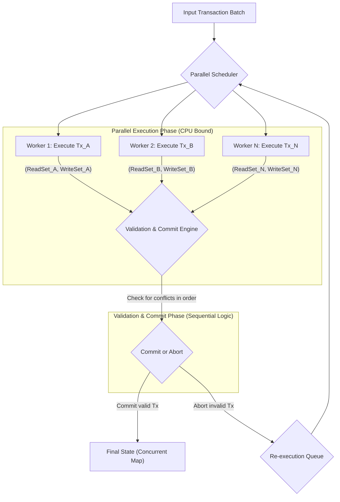

# 1. Parallel EVM Transaction Processing

To architect a high-throughput system for processing EVM transactions without prior knowledge of their state access, the ideal model is **optimistic execution**. This strategy assumes transactions can run without conflict, executes them in parallel, and then verifies this assumption before committing the results. This approach is sometimes called Block-STM.

### Data Structure for Parallel Execution

The key is to provide each parallel worker thread with an isolated, temporary view of the state while allowing fast, concurrent reads from the canonical state.

* **Shared State**: The initial state (e.g., account balances, contract storage) is loaded into a concurrently readable data structure. A **sharded concurrent hash map** (like `DashMap` in Rust) is perfect, as it allows many threads to read from it at once with minimal blocking.
* **Local Transaction Buffers**: Each worker thread processing a transaction does not write to the shared state directly. Instead, it maintains two local buffers:
    * **Read Set**: A `HashSet<StorageKey>` to log every state slot the transaction reads.
    * **Write Set**: A `HashMap<StorageKey, StorageValue>` to stage any state changes the transaction makes.

### Dealing with Conflicting Storage Slots

Conflicts are identified and resolved *after* the initial parallel execution phase during a sequential **validate-and-commit phase**. This process occurs in the following steps:

1.  **Parallel Execution**: The entire batch of transactions is run in parallel by a pool of worker threads. Each successful execution produces a read set and a write set.
2.  **Sequential Validation**: The system iterates through the transactions in their original, deterministic order. For each transaction `Tx_N`, it checks if its execution is still valid by comparing its **read set** against the combined **write sets** of all preceding, validated transactions (`Tx_1`...`Tx_{N-1}`).
3.  **Resolution**: Based on the validation check, one of two actions is taken:
    * **No Conflict**: The transaction is valid. Its **write set is applied to the shared state**, making its changes visible to subsequent validation steps.
    * **Conflict**: The transaction's result is stale and invalid. It is **sent back to be re-executed** against the newly updated state. This cycle repeats until the transaction can be validated successfully.

### Detailed Validation Algorithm and Optimization

The process of checking a transaction's read set against all previous write sets can be slow if not handled carefully.

#### The Simple (Naive) Algorithm

Imagine a single list of all the storage locations that have been changed so far in the batch. For each new transaction you validate, you have to check every single item it read against this growing list. This gets slower as you validate more transactions.

#### The Optimized Algorithm: State Versioning

A much faster way is to give each piece of data a version number, like a version on a document.

1.  **During Execution**: When a transaction reads a piece of data, it not only notes *what* it read but also the *version number* of that data at that moment (e.g., "Account A, Version 5").
2.  **During Validation**: The validator keeps track of the latest version number for every piece of data. To validate a transaction, it simply checks:
    * "Did you read 'Account A, Version 5'?"
    * "Is the latest version of 'Account A' still 5?"

    If the latest version is now 6, it means another transaction updated it, and the data you read is old. The transaction is invalid and must be re-run. If the versions match, it's valid.

**Why is this faster?** Checking a version number is a direct, instant lookup and a simple number comparison. It's much quicker than searching through a long list of changed items, making the validation process significantly more efficient.

### Execution and Storage Design

The architecture is a multi-stage pipeline designed to keep all CPU cores saturated with useful work while guaranteeing serializable consistency.

### Optimization: Parallelizing the Validation Phase

A key observation is that a purely single-threaded validation loop can become a bottleneck. While the validation *logic* is sequential, the process itself can be parallelized by building a **Directed Acyclic Graph (DAG)** of dependencies on the fly.

  * **Step 1**: The validator attempts to validate a large group of transactions in parallel.
  * **Step 2**: When a conflict is detected (e.g., `Tx_B` reads a value written by `Tx_A`), `Tx_B` is marked as **dependent** on `Tx_A` instead of just being aborted.
  * **Step 3**: The validator continues processing other transactions, like `Tx_C` and `Tx_D`, that might have no dependencies and can be committed immediately.
  * **Step 4**: Once `Tx_A` is committed, the system knows that its dependent, `Tx_B`, can now be re-executed.

This dynamic approach is far more efficient. It allows the system to commit independent transactions in parallel and intelligently schedule the re-execution of only those that were directly affected by a conflict, significantly reducing the validation bottleneck.
